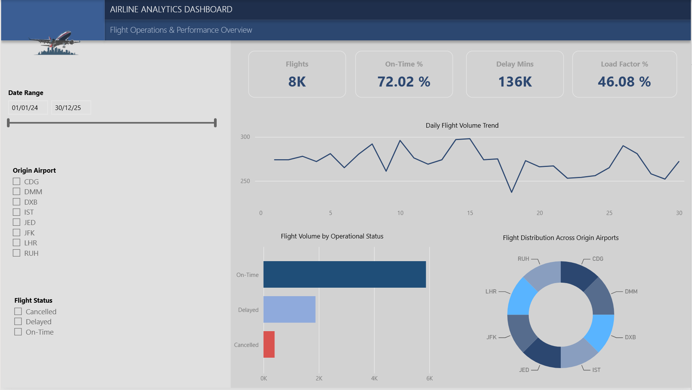
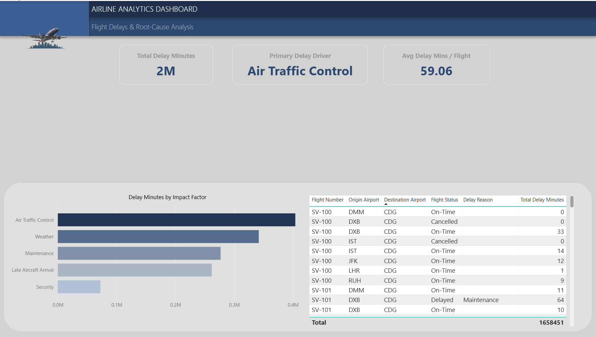
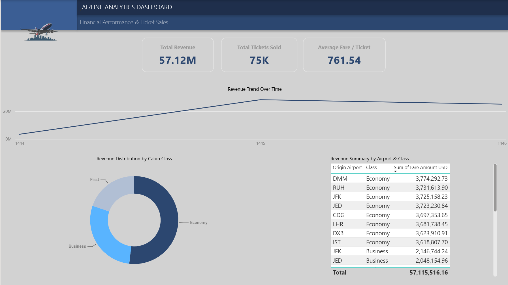
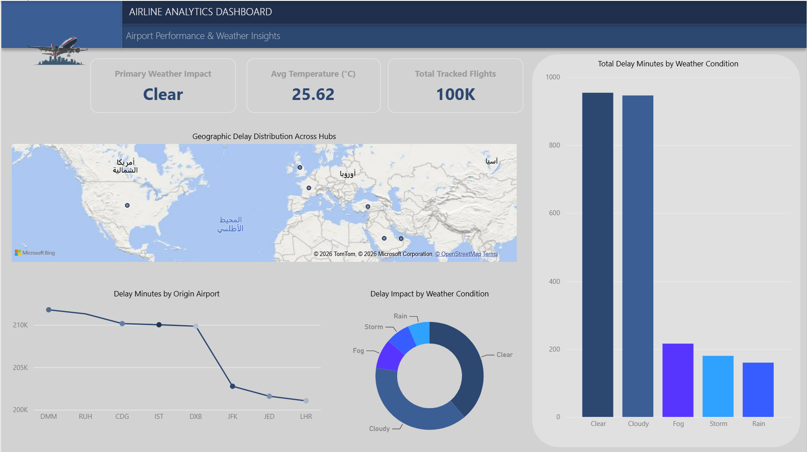

# 🛫 Enterprise Airline Analytics & Operational Performance Dashboard

[](https://powerbi.microsoft.com/)
[](#-data-architecture--modeling)
[](#-dax-modeling--key-measures)

---

## Executive Summary
An end-to-end Business Intelligence solution built in **Power BI** to monitor flight operations, evaluate delay root causes, track revenue yield across cabin classes, and analyze spatial-temporal weather impact across major international airports.

---

## Dashboard Preview

### 1️⃣ Flight Performance (Operations Overview)


### 2️⃣ Delays Breakdown (Root-Cause Analysis)


### 3️⃣ Revenue & Ticket Sales (Financial Performance)


### 4️⃣ Airport & Weather Insights (Spatial & Environmental)


---

## 🎯 Business Problem & Core Objectives
Aviation operations handle high-volume transactional data across operational, commercial, and environmental domains. This dashboard addresses four primary business objectives:
* **Operational Efficiency:** Tracking On-Time Performance (OTP %) and fleet Load Factors.
* **Root-Cause Delay Attribution:** Separating controllable operational delays (Maintenance, Air Traffic Control) from meteorological factors.
* **Revenue Yield Analysis:** Monitoring ticket sales and revenue distribution across cabin classes (First, Business, Economy) and hubs.
* **Geospatial & Weather Impact:** Evaluating flight disruptions relative to real-time weather conditions and ambient temperature variations.

---

## Data Architecture & Modeling
The solution uses an optimized **Star Schema** data model to enable accurate aggregation and high-performance DAX evaluations.

```text
               +-------------------+
               |   Dim_Aircraft    |
               +---------+---------+
                         |
                         | 1:N
+-----------------+      v      +------------------+
|  Dim_Airports   +------------>+   Fact_Flights   +<---------------+
+-----------------+ 1:N    1:N  +--------+---------+ 1:N            |
                                         |                          |
                                         | 1:1                      | 1:N
+-----------------+             +--------v---------+      +---------+--------+
|   Fact_Delays   +<------------+   Fact_Tickets   |      |   Fact_Weather   |
+-----------------+ 1:1         +------------------+      +------------------+
