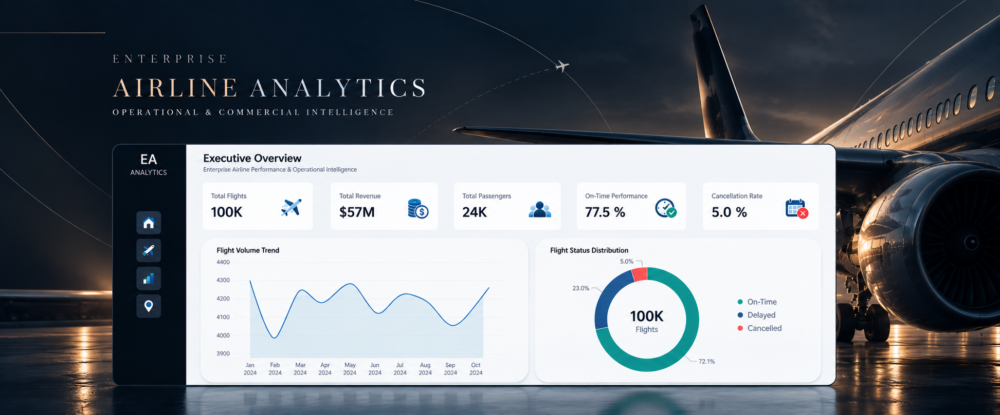
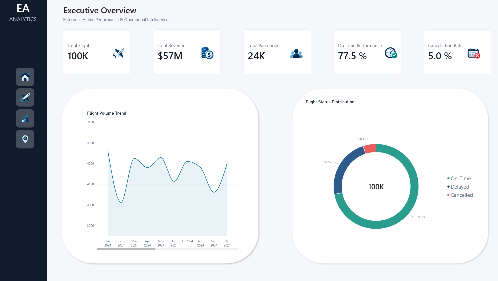
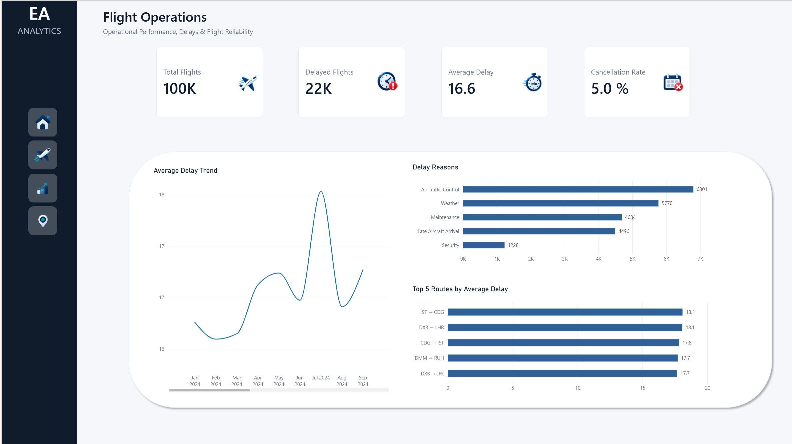
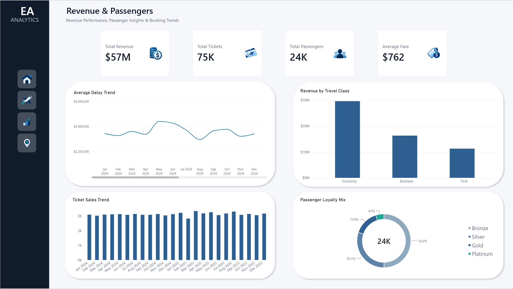
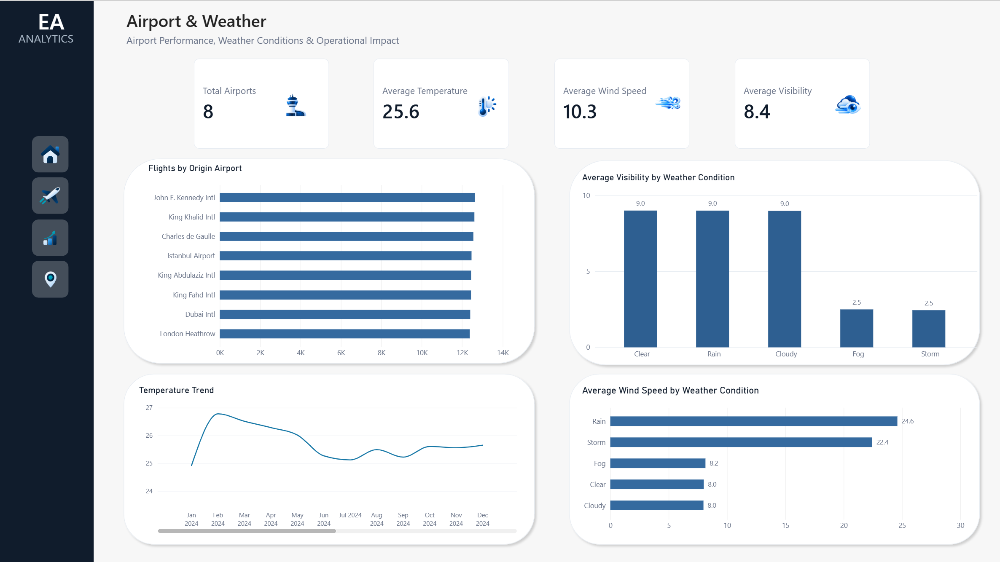
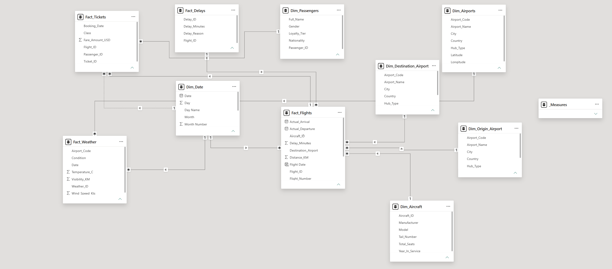

<p align="center">
  
</p>

<h1 align="center">ENTERPRISE AIRLINE ANALYTICS</h1>

<p align="center">
  <strong>Operational & Commercial Intelligence</strong>
</p>

<p align="center">
  An interactive Power BI solution for analyzing airline operations, revenue, passengers, airports, and weather conditions.
</p>

<p align="center">
  <a href="https://app.powerbi.com/view?r=eyJrIjoiMzAzZTI1YWItNzE4ZS00M2FlLWIwMjMtMGE0ZTA1NTEwM2RlIiwidCI6IjJkMzE5NGUzLTE2NTQtNDZiZC1iYWUyLWFkMzdiYTExYjBhZSIsImMiOjl9">
    <strong>VIEW INTERACTIVE DASHBOARD →</strong>
  </a>
</p>

<p align="center">
  <strong>100K</strong> Flights &nbsp;&nbsp;·&nbsp;&nbsp;
  <strong>$57.1M</strong> Revenue &nbsp;&nbsp;·&nbsp;&nbsp;
  <strong>75K</strong> Tickets &nbsp;&nbsp;·&nbsp;&nbsp;
  <strong>23.8K</strong> Passengers
</p>

<br>

---

## 01 | THE CHALLENGE

Airline performance depends on more than flight volume alone. Delays, cancellations, passenger activity, ticket revenue, airport operations, and weather conditions all contribute to the overall picture.

The challenge was to bring these areas together in one reporting environment instead of analyzing them separately. The dashboard was built to make it easier to track overall performance, identify operational issues, and understand how commercial activity changes across the network.

The analysis focuses on three questions:

1. How well is the airline performing operationally?
2. Where are delays and cancellations occurring?
3. What patterns can be seen across revenue, tickets, and passenger activity?

<br>

---

## 02 | ANALYTICAL SCOPE

The report is organized into four views, with each page focusing on a different part of airline performance.

| Area | Analysis |
|---|---|
| **Executive Overview** | Flight volume, revenue, passengers, on-time performance, and cancellations |
| **Flight Operations** | Delay trends, delay reasons, route performance, and flight reliability |
| **Revenue & Passengers** | Revenue, ticket sales, travel classes, and passenger loyalty |
| **Airport & Weather** | Airport activity, visibility, temperature, wind speed, and weather conditions |

<br>

---

## 03 | DASHBOARD

### Executive Overview

A high-level view of the main operational and commercial KPIs.

<p align="center">
  
</p>

<br>

### Flight Operations

A closer look at delays, their causes, and route-level performance.

<p align="center">
  
</p>

<br>

### Revenue & Passengers

Revenue and ticket performance, supported by passenger and travel class analysis.

<p align="center">
  
</p>

<br>

### Airport & Weather

Airport activity and weather measures used to examine operating conditions across the network.

<p align="center">
  
</p>

<br>

---

## 04 | KEY FINDINGS

The dataset contains **100,000 flights**, with **77.5%** meeting the defined on-time threshold of 15 minutes or less.

Flights delayed by more than 15 minutes account for **22.5%** of total flights. The average recorded delay is **16.6 minutes**, while the cancellation rate is **5.0%**.

Ticket sales generated **$57.1M** in revenue from **75,000 tickets**. The average fare is **$762**, and Economy Class contributes the largest share of revenue at approximately **$30M**.

The analysis also covers **23,765 unique passengers**, allowing passenger activity and loyalty segments to be viewed alongside commercial performance.

<br>

---

## 05 | DATA MODEL & DAX

The Power BI model connects flight, ticket, delay, passenger, aircraft, airport, date, and weather data through defined relationships.

<p align="center">
  
</p>

A dedicated measures table keeps the main business calculations organized. The report uses DAX measures for:

- Total Flights
- Total Revenue
- Total Tickets
- Total Passengers
- On-Time Performance
- Delayed Flights and Delay Rate
- Cancelled Flights and Cancellation Rate
- Average Delay
- Average Fare
- Revenue per Flight

The date dimension supports time-based analysis, while separate origin and destination airport dimensions support route analysis without ambiguous relationships.

<br>

---

## 06 | PROJECT STRUCTURE

```text
Enterprise-Airline-Analytics-Dashboard/
│
├── assets/
│   ├── airline-analytics-hero.png
│   ├── executive-overview.png
│   ├── flight-operations.png
│   ├── revenue-passengers.png
│   ├── airport-weather.png
│   └── data-model.png
│
├── dashboard/
│   └── Enterprise_Airline_Analytics.pbix
│
├── data/
│   ├── Dim_Aircraft.csv
│   ├── Dim_Airports.csv
│   ├── Dim_Passengers.csv
│   ├── Fact_Delays.csv
│   ├── Fact_Flights.csv
│   ├── Fact_Tickets.csv
│   └── Fact_Weather.csv
│
└── README.md
```

<br>

---

<p align="center">
  <strong>Designed & Developed by Dana Alhazmi</strong>
</p>

<p align="center">
  Data Modeling · Analytics · Dashboard Architecture · Visual Design
</p>
